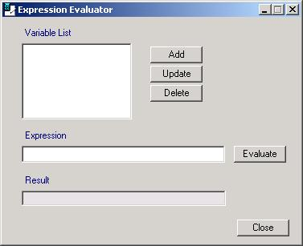



## Expression Evaluator

### Description

VB does not provide a means to enter and evaluate a math formula as a text string. A coworker of mine pointed out that Autodesk's LISP has a function EVAL that does exactly that. You can even plug in variables. I searched the web and discovered that plugins are available for VB, but cost hundreds of dollars. Screw that! I wrote my own. Here you are, I'll give you all what I could not find anywhere...a complete functional expression evaluator that accepts as many variables as you need. It understands every math function that is supported in VB. Extract the files from the zip file and run the VB project. Feel free to copy the code and make whatever modifications you wish to suit your needs. Have fun!
 
### More Info
 

             |
---                |---
**Submitted On**   |2002-06-11 07:31:14
**By**             |[TJohnston](https://github.com/Planet-Source-Code/PSCIndex/blob/master/ByAuthor/tjohnston.md)
**Level**          |Intermediate
**User Rating**    |4.8 (19 globes from 4 users)
**Compatibility**  |VB 3\.0, VB 4\.0 \(16\-bit\), VB 4\.0 \(32\-bit\), VB 5\.0, VB 6\.0
**Category**       |[Math/ Dates](https://github.com/Planet-Source-Code/PSCIndex/blob/master/ByCategory/math-dates__1-37.md)
**World**          |[Visual Basic](https://github.com/Planet-Source-Code/PSCIndex/blob/master/ByWorld/visual-basic.md)
**Archive File**   |[Expression929136112002\.zip](https://github.com/Planet-Source-Code/tjohnston-expression-evaluator__1-35715/archive/master.zip)

